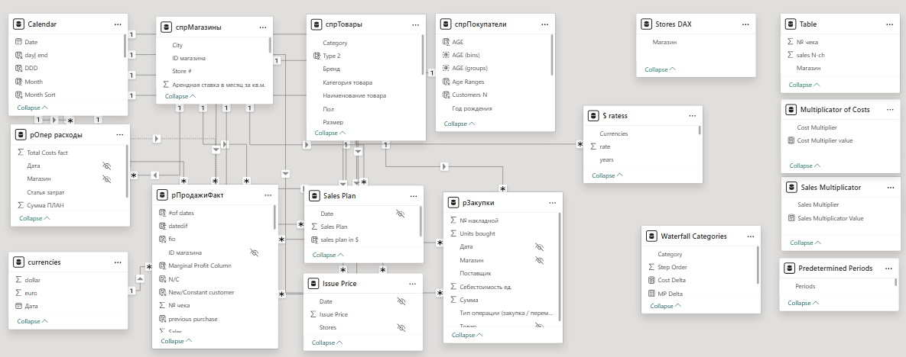
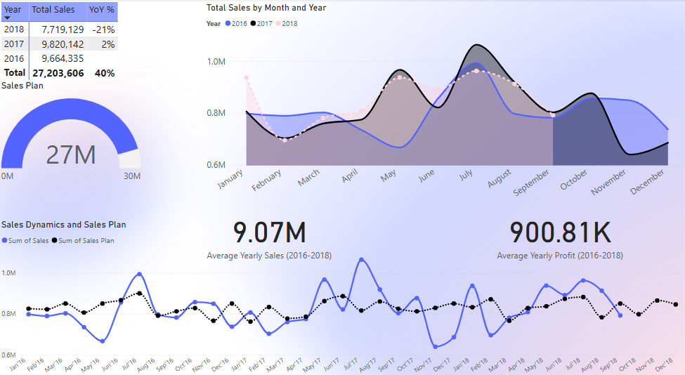
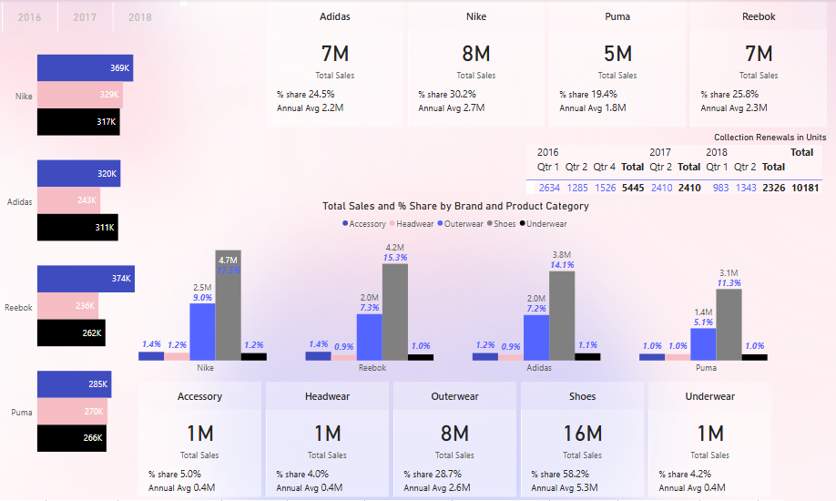
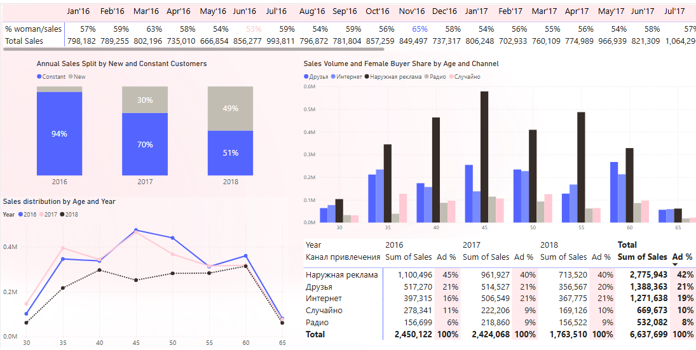
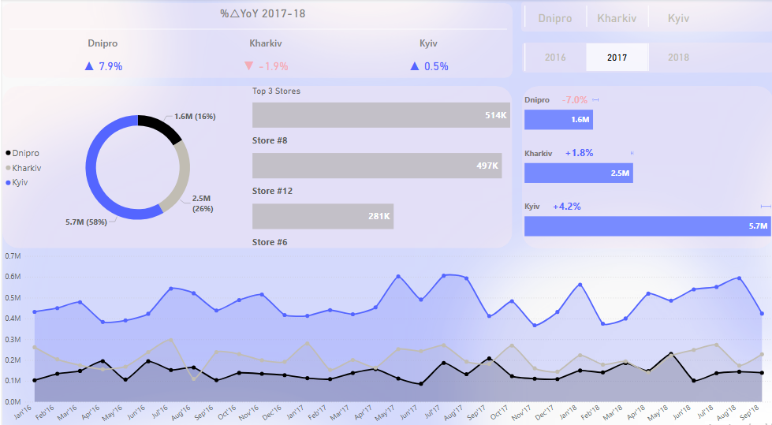
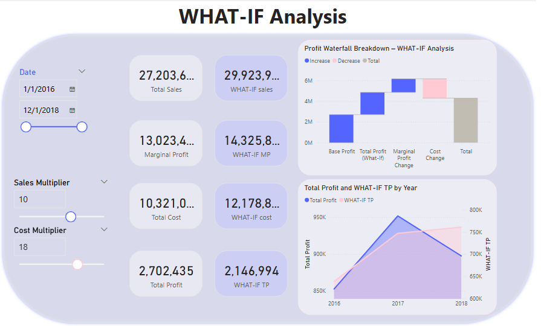

# Ukrainian-Retail-Sales-Analysis-2016-2018

Table of Contents

- [Project Background](#project-background)
- [Executive Summary](#executive-summary)
- [Data Preparation](#data-preparation)
- [In-Depth Analysis](#in-depth-analysis)
    - [Sales Trends and Growth Rates](#sales-trends-and-growth-rates)
    - [Key Brand and Product Performance](#key-brand-and-product-performance)
    - [Customer Segmentation and Behavior](#customer-segmentation-and-behavior)
    - [Regional Trends Analysis](#regional-trends-analysis)
    - [What-If Analysis](#what-if-analysis)
- [Recommendations](#recommendations)
- [Assumptions and Caveats](#assumptions-and-caveats)

***

## Project Background

A Ukrainian retail company with twelve branches across three cities — Kyiv, Kharkiv, and Dnipropetrovsk — specializes in footwear and apparel, offering up to fifteen different product categories under four major brands: Adidas, Nike, Puma, and Reebok. This project analyzes sales data from 2016 to 2018 to extract insights and deliver recommendations to improve performance across sales, product, marketing and operations teams.

## Executive Summary

An analysis of 18,000 sales records from a Ukrainian retail company across 2016–2018 shows annual revenue stabilizing at around 9 million UAH. The distribution of sales by region is as follows: 57.54% in Kyiv, 25.27% in Kharkiv, and 17.19% in Dnipropetrovsk indicating a potential opportunity to grow market presence in the latter two regions. Nike accounts for the largest share of sales at 30%, followed by Reebok and Adidas, each with 25–26%. These proportions remained mostly consistent throughout the three years. Additionally, 57% of customers were female.

Notably, the share of new customers increased significantly over time — from just 5% in 2016 to 49.5% in 2018. Customers were labeled as “constant” if they had purchased within the previous three months; otherwise, they were considered new.

The company could improve performance by expanding top-selling product lines, targeting female shoppers, and implementing loyalty programs. Regionally focused initiatives may also enhance sales in Kharkiv and Dnipropetrovsk.

Dataset ERD, Star Schema

## Data Preparation

The raw sales data from multiple sources and formats was cleaned, transformed, and structured to support further analysis. This process included:

- **Data Cleaning:** Handled missing values (e.g., when calculating new vs. constant customers), corrected inconsistencies (such as store name formatting and numeration), and standardized encodings (including UTF adjustments for newer branches).

- **Data Integration and Modeling:** Merged datasets from sales (рПродажиФакт), products (спрТовары), customers (спрПокупатели), costs (рОпер расходы), collection renewals (рЗакупки), stores (спрМагазины), issue prices, and sales plans into a unified model. A star schema was designed to optimize relationships between sales and other dimension tables.

- **Calculated Measures:** Developed over 80 DAX measures for reporting, including a custom calendar table, age group segmentation, profitability metrics, brand and regional performance comparisons, What-If analysis, and time intelligence functions (e.g., YoY, MoM).

- **Date Handling:** Standardized varying date formats (e.g., DD-MM-YY, MM/DD/YY) and applied dynamic filters for time-based analysis.

## In-Depth Analysis

### Sales Trends and Growth Rates

Sales data from 2016 to 2018 shows annual revenue averaging 9 million UAH with a profit margin of approximately 900K. Seasonal trends are evident, with peak sales occurring during the summer and around the New Year holidays. While both actual and planned sales follow a generally upward trend, actual sales underperformed by nearly 3 million UAH over the period. A notable gap emerged during summer 2017, suggesting planners may have underestimated seasonal demand. Similar discrepancies appear across other years, with sharp declines observed in mid-Q2 2016 and Q4 2017. These insights point to opportunities for improving demand forecasting and aligning planning processes with real-world seasonal shifts.

### Key Brand and Product Performance

Footwear dominates sales, making up 60% of total revenue (~5.2M UAH annually), led by Nike (30%, ~2.7M UAH), followed by Reebok and Adidas. Outerwear is the second-best-selling category, contributing 30% of sales (~2.5M UAH). Other categories individually account for less than 5%. Seasonal collection renewals typically occur in Q1–Q2 ahead of summer peaks. Expanding high-margin lines—especially Nike footwear (703 UAH avg.)—can boost profitability. Lower-margin items like accessories (169 UAH) and headwear (154 UAH) may benefit from bundling or volume promotions to maintain their contribution.

### Customer Segmentation and Behavior 

New customers rose sharply from 5% in 2016 to 49.5% in 2018, showing strong acquisition performance. For customer attraction outdoor advertising remained the top channel (42% of sales), followed by referrals (21%) and internet channels (19%). Radio ads accounted for 8%, with only slight channel share shifts over three years— Outdoor advertising’s share dropped by 4%, while internet channels grew at a similar rate — suggesting improved performance and greater effectiveness of digital campaigns in attracting customers. Women made up 57% of customers, with monthly shares ranging from 53% to 65%. Most buyers were aged 35–60, especially 40–50, suggesting marketing efforts should focus on this core demographic.

### Regional Trends Analysis

Kyiv leads with ~58% of annual revenue, followed by Kharkiv (25%) and Dnipro (17%). Sales distribution across regions is stable, with ~2% annual fluctuation. YoY growth trends are positive in Kyiv (+4%) and Kharkiv (+2%), while Dnipro saw a 7% drop in 2017. For the same period in 2018 (through September 20), Dnipro and Kyiv grew by 8% and 1%, respectively, while Kharkiv declined by 2%. Store expansion started in Kyiv (7 branches), followed by Dnipro (3) and Kharkiv (2). The top-performing stores were Dnipro #8 (513,898 UAH), Kyiv #12 (497,079 UAH), and Kharkiv #6 (281,438 UAH). Seasonal patterns affect all regions, peaking around holidays and summer months.

### What-If Analysis 

The What-If Analysis dashboard allows users to simulate the effects of changing sales volume and cost levels on overall profitability. It includes actual metrics such as revenue, cost, marginal profit, and total profit, alongside scenario-based figures calculated using adjustable sales and cost multipliers.
Users can explore how increases or decreases in either factor impact key performance indicators in real time. This helps identify break-even thresholds, assess risk, and support pricing or budgeting decisions.
The dynamic dashboard enhances strategic planning by allowing stakeholders to model potential business scenarios interactively — without altering the base dataset. 

## Recommendations

1. Boost High-Margin Product Performance – Nike footwear leads in sales and offers strong profit potential. Expand with seasonal or limited editions and diversify inventory to encourage repeat purchases. Bundle lower-margin items like accessories and headwear with bestsellers to maintain contribution without hurting profitability.
2. Improve Customer Retention – With new customer share rising from 5% to 49.5%, retention is critical. Launch a loyalty program (e.g., points, birthday perks) and automate post-purchase outreach within 3 months to nurture repeat buyers.
3. Expand Regional Growth in Kharkiv and Dnipro – While Kyiv holds 58% of sales, Dnipro and Kharkiv show promise. Replicate strategies from top-performing stores (Dnipro #8, Kharkiv #6), and invest in local marketing, referrals, and community events.
4. Shift to Digital Channels – Outdoor ads drive 42% of sales but are losing impact. Focus on social media, SEO, and affiliate marketing. Use referral codes and track ROAS (Return on Ad Spend) to improve efficiency.
5. Plan Around Seasonal Demand – Refine forecasting by incorporating seasonal peaks and promo calendars. Allocate stock early to meet high demand during summer and holiday seasons.
6. Integrate What-If Dashboards – Use interactive dashboards in quarterly reviews to model pricing, discount, and volume scenarios. Help managers make smarter, data-driven decisions.

***

## Assumptions and Caveats

- This analysis is based on historical sales data from January 1, 2016, through September 20, 2018. Due to the dataset ending before Q4 2018, full-year comparisons for that year—especially year-over-year growth—are estimated using same-period data from 2017. This limitation affects the accuracy of long-term trends.

- The original dataset and metadata were in Russian. All relevant fields were translated to English during the data cleaning and modeling process to ensure accessibility and clarity for a broader audience. This may have introduced minor discrepancies in naming conventions.

- Finally, the report assumes that provided sales, cost, and demographic records are accurate and complete. No external data sources were used to validate figures. The analysis relies on internal assumptions for customer classification (“new” vs. “constant”) and consistent category naming throughout the period.

***

